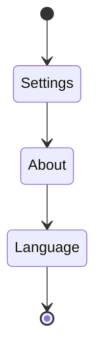
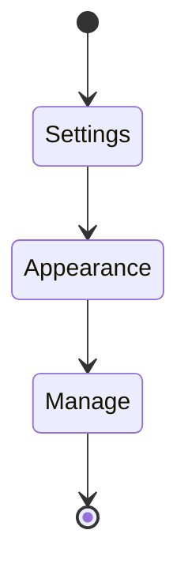
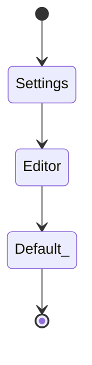

## Başlarken

#### Dil
Dilinizi değiştirmek isterseniz sol alt köşede bulunan **`Settings`** bölümünden`About` sekmesine tıklayıp `Language` alanından değiştirebilirsiniz.

#### Tema
Ve eğer temanızı değiştirmek isterseniz yine sırasıyla `Settings->Appearance->Manage` işlemlerini yapmanız gerekiyor.

#### Görüntüleme Modu
Başlangıçta görüntüleme modunu değiştirmek için `Setting->Editor->Default view for new tabs` ayarından `Reading view` opsiyonunu seçmenizi tercih ederim.

---

![[Easter Eggs]]

---

## Açıklama
Obsidian `metin-tabanlı` ömürlük bir %%Ömürlük 😄 kendi fikrimce tabi ki %%not alma uygulamasıdır. **`Electron JS`**[^1] kullanılarak geliştirilmiştir. Uygulamayı öne çıkaran özelliklerinden bir tanesi notların birbirlerine bağlanması **`Internal Links`** özelliğidir ve bağlanan notları da **`Graph View`** sekmesinden görsel olarak görebiliyoruz. %% Harbiden müthiş özellik görünce hayran kaldığım bir şey idi. %% Bu özelliği bence ==yaratıcılığınıza== bağlı olaraktan farklı amaçlar için de kullanılabilir olduğu kanısındayım. Uygulamanın ilhamı ve felsefesi **Zettelkasten**[^2] methoduna dayanıyor. **Zettelkasten** methodu kısaca bir çeşit not alma işlevidir.

---

## Hikaye
Obsidian uygulamasının geliştirilmesi **Shida Li** ve **Erica Xu** isimli iki arkadaşa dayanıyor. Bu iki arkadaş piyasa da bulunan birçok not uygulamasını deniyor fakat hiçbirinde istedikleri özellikleri bulamıyorlar. Bunun üzerine bu uygulamayı geliştirmeyi planlıyorlar. Hatta uygulamayı geliştirmeye karantina zamanlarında başlamışlar. Uygulamanın mottosu **`second brain`** ya da yazılan notlar için **`Note IDE`** olarak belirlenmiş[^3].

## Navigasyon
Uygulama birçok özellik içerdiğinden kategorileştirme ihtiyacı hissettim. O yüzden özellikleri şu başlıklar altında toplamak isterim:
1. [[Başlıklar]]
2. [[Listeler]]
3. [[Görev Kutuları]]
4. [[Alıntılar]]
5. [[Uyarı Metinleri]]
6. [[Kod Blokları]]
7. [[Gizli Yorumlar]] %%Easter Eggs 😸%%
8. [[Diyagramlar]] 
9. [[Yerleştirmeler]]
10. [[Vurgular]]
	1. [[Üstünü Çizme]]
	2. [[Kalınlaştırma]]
	3. [[Eğikleştirme]]
	4. [[Parıldatıcı]]
	5. [[Satıriçi Kodlar]]
11. [[Dip Notları]]
12. [[Resimler]]
13. [[Linkler]]
	1. [[Dış Linkler]]
	2. [[URI Linkler]]
	3. [[İç Linkler]]
19. [[Yatay Bölücü]]
20. [[Formüllemeler]]
21. [[Tablolar]]
22. [[Etiketler]]
23. [[Video Gömme]]
24. [[Ses Kaydetme]]
25. [[Hotkeys]]
26. [[Ara, Bul ve Değiştir]]
27. [[Çıktı alma]]
28. [[İçe Aktarma]]
29. [[Taslaklar]]
30. [[Günlük Notlar]]
31. [[Satır Boşluğu]]
32. [[Sorgu Blokları]]
33. [[Yeni Notların Konumu]]
34. [[Pano]]
35. [[Özellikler (Properties)]]

---

## Son olarak

![[Son Olarak]]

[^1]:[Zettelkasten](https://en.wikipedia.org/wiki/Zettelkasten)
[^2]:[ElectronJS](https://www.electronjs.org/)
 [^3]:[Obsidian About](https://obsidian.md/about)