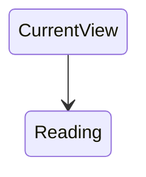

Bu `Vault`, hazırladığım dosyaların bazı yerlerinde **Easter Egg**'ler%%İç sesim de diyebiliriz 😅%% bulunduruyor. Merak ederseniz ufak bir kurcalamayla yaptığım şeyleri bulabilirsiniz. %% Easter Egg dosyasına da easter egg konulmazsa ayıp olunur. 😸%%

---

> [!Warning]- Uyarı
> Bu yönergeyi şu an bulunduğunuz not sayfasının sağ üst köşesinde bulunan **üç nokta (More Options)** işaretinin bulunduğu sekmede bulunan **Current View** modunu `editing` yapmanızı öneririm.

