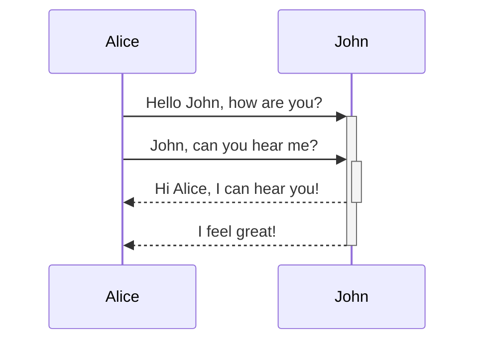
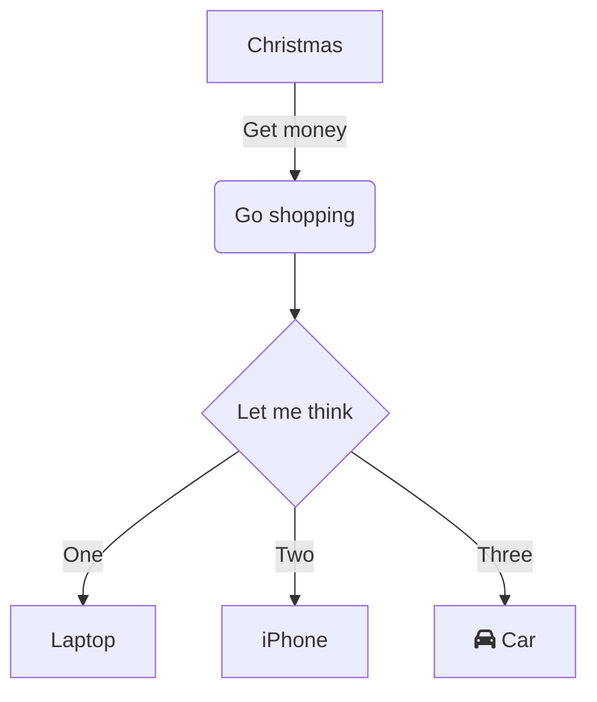
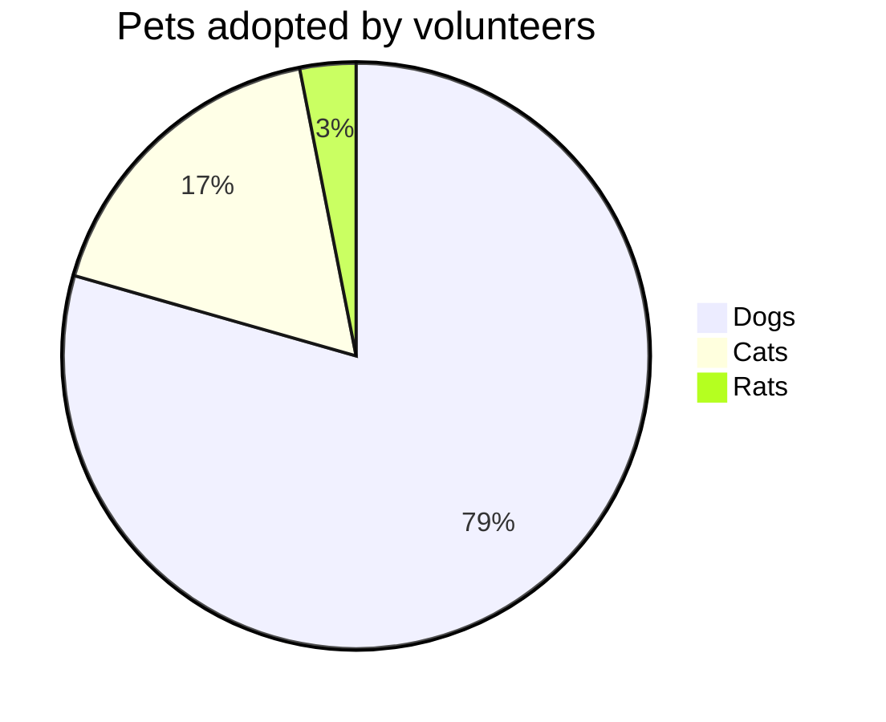
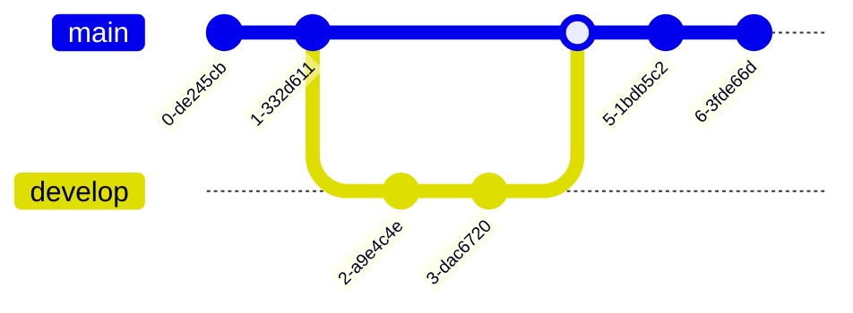
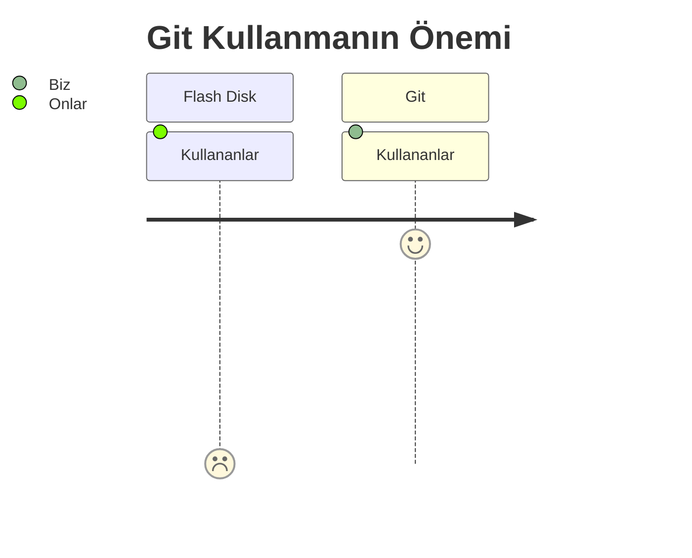

Obsidian diyagramlar için [**Mermaid**](https://mermaid-js.github.io/) denilen diyagramlar ve grafik çizimleri işlevini kullanır. **Mermaid'in canlı editor**[^1] ortamını kullanarak diyagramlar veya grafikler oluşturup Obsidian'a ekleyebilirsiniz.

Yapılış şekilleri;

<pre><code>```mermaid
sequenceDiagram
    Alice->>+John: Hello John, how are you?
    Alice->>+John: John, can you hear me?
    John-->>-Alice: Hi Alice, I can hear you!
    John-->>-Alice: I feel great!
```</code></pre>

<pre><code>```mermaid
graph TD
A[Christmas] -->|Get money| B(Go shopping)
B --> C{Let me think}
C -->|One| D[Laptop]
C -->|Two| E[iPhone]
C -->|Three| F[fa:fa-car Car]
```</code></pre>

<pre><code>```mermaid
pie title Pets adopted by volunteers
"Dogs" : 386
"Cats" : 85
"Rats" : 15
```</pre></code>
<pre><code>```mermaid
gitGraph
commit
commit
branch develop
checkout develop
commit
commit
checkout main
merge develop
commit
commit
```</pre></code>
---

---

---

---


%%Git çok önemli dostlarım. 🐱 Altta ki tabloda bunun bir göstergesi ve örneği.

%%


[^1]:[Canlı editor ortamı için](https://mermaid-js.github.io/mermaid-live-editor)