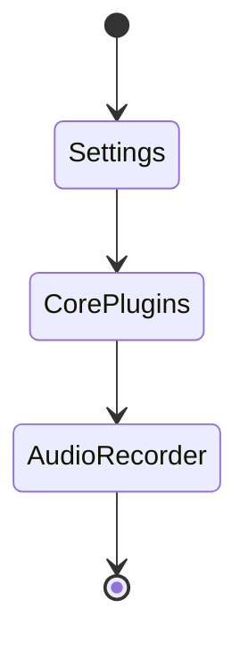

Öncelikle **ses kaydetme** özelliğini aktif hale getirmemiz gerekiyor `Settings->Core Plugins->Audio Recorder` özelliğini açın. Sonrasında sol tarafta ki menüde `Start\stop recording` butonunun aktif hale geldiğini göreceksiniz. O butona basarak ==önce sesinizi kaydedip tekrar bastığınızda ses kaydınızı kaydedip bulunduğunuz not sayfasına ses kaydını ekleyebilirsiniz.== %% tekerleme gibi oldu. 😸%%


```md
![[Recording 20221121000919.webm -> Ses kaydı bağlantısını eklenmeli
```
![[Recording 20221121000919.webm]]
