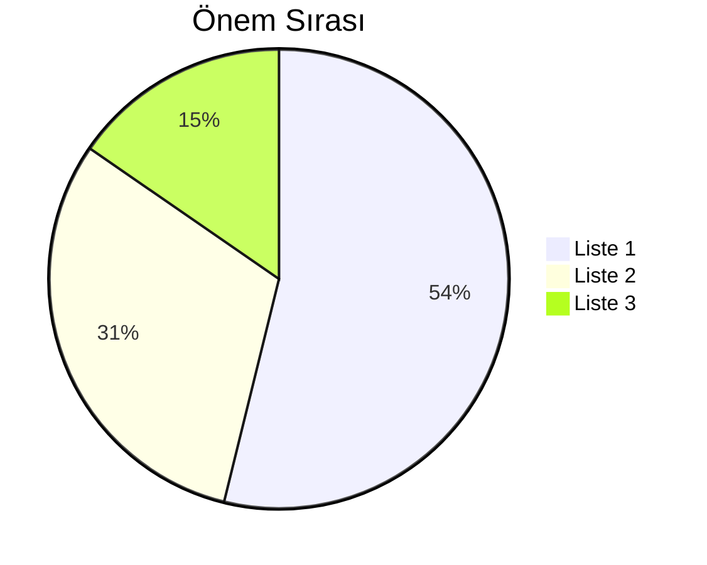

Sürekli olarak farklı not sayfaların da kullandığınız **aynı bir yapı** var ise, bir iskelet ve bunu hazırlamaya zamanınız gidiyorsa bunu bir şablon haline getirerek farklı not sayflarında aynı yapıyı hızlı bir biçim de kullanabilirsiniz. ^b8862b

>[!Warning]- Uyarı
>  Bu özellik açık değilse `Settings -> Core Plugins -> Templates` buradan aktif etmeniz gerekmektedir.

Öncelikle, bir **Templates** klasörü oluşturmanız gerek bu klasörün ismi size kalmış. 
Sonra `Settings -> Templates` sekmesinden varsayılan **Templates** klasörünüzü seçmeniz gerek. İçerisine notlar oluşturup **taslaklarınızı** hazırlayabilirsiniz. Hazırladığınız taslakları da bir  bir not sayfasında kullanmak için **sağ tarafta bulunan kenar panelden** `Inset template` özelliğinden şablonlarınızı not sayfanıza ekleyebilirsiniz. ^taslakparagraf

---

[[Günlük Not Taslağı]];

#### 2023.03.11 Tarihli Günlük Not

Günlük not şablonu içeriği.

#günlük-not-taslağı-etiketi

 

---

[[Liste Taslağı]];

Başlık: Taslaklar
Tarih: 11.03.2023

- Liste 1
- Liste 2
- Liste 3

 

---

[[Tablo Taslağı]];

Başlık: Taslaklar
Tarih: 11.03.2023

Taslak Başlık | Taslak Başlık 2 | Taslak Başlık 3
-------------- | -------------- | -------------- 
Hücre 1 | Hücre 2 | Hücre 3
Hücre 1 | Hücre 2 | Hücre 3
Hücre 1 | Hücre 2 | Hücre 3
Hücre 1 | Hücre 2 | Hücre 3
Hücre 1 | Hücre 2 | Hücre 3
Hücre 1 | Hücre 2 | Hücre 3

